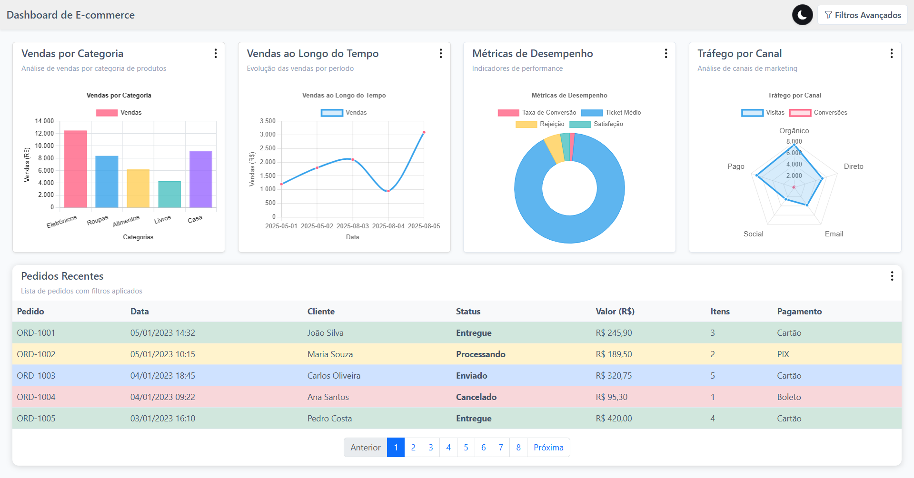
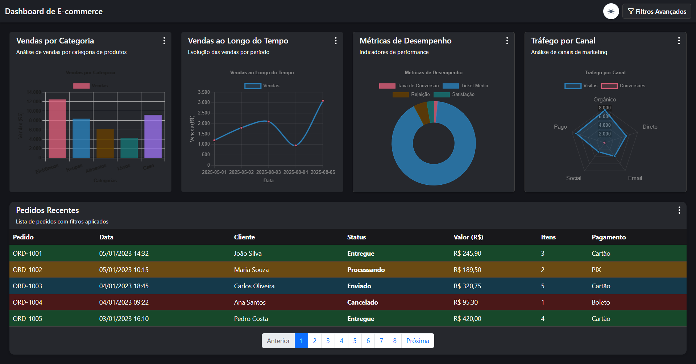

# Dashboard de E-commerce

Dashboard interativo para análise de dados de e-commerce desenvolvido com Angular (frontend) e NestJS (backend).

## 🚀 Funcionalidades
### Light Mode


### Dark Mode  


- **4 Gráficos Interativos:**
  - Vendas por Categoria (Gráfico de Barras)
  - Vendas ao Longo do Tempo (Gráfico de Linhas) - Em desenvolvimento
  - Métricas de Desempenho (Gráfico de Rosca) - Em desenvolvimento
  - Tráfego por Canal (Gráfico de Radar) - Em desenvolvimento

- **Tabela de Pedidos:**
  - Exibição de pedidos com paginação e ordenação
  - Destaque visual por status
  - Em desenvolvimento

- **Sistema de Filtros Avançados:**
  - Filtro por período de datas
  - Filtro por horário (opcional)
  - Seleção múltipla de categorias
  - Filtro por status de pedidos
  - Filtro por método de pagamento
  - Faixa de valores (mínimo/máximo)

## 🛠️ Tecnologias Utilizadas

### Backend (NestJS)
- **Framework:** NestJS
- **Linguagem:** TypeScript
- **Porta:** 3001
- **Endpoints:** RESTful APIs para gráficos e pedidos

### Frontend (Angular)
- **Framework:** Angular 16
- **Linguagem:** TypeScript
- **Porta:** 4200
- **UI Framework:** Angular Material
- **Gráficos:** Chart.js com ng2-charts
- **Estado:** BehaviorSubject para comunicação entre componentes


## 🚀 Como Executar

### Pré-requisitos
- Node.js (versão 20.11.0 ou superior)
- npm ou yarn

### Backend (NestJS)

1. **Navegar para o diretório do backend:**
   ```bash
   cd frontend/api
   ```

2. **Instalar dependências:**
   ```bash
   npm install
   ```

3. **Executar em modo de desenvolvimento:**
   ```bash
   npm run start:dev
   ```

4. **Acessar a API:**
   - URL: http://localhost:3001
   - Endpoints disponíveis:
     - `GET /api/charts/sales-by-category`
     - `GET /api/charts/sales-trend`
     - `GET /api/charts/performance-metrics`
     - `GET /api/charts/traffic-channels`
     - `GET /api/orders`

### Frontend (Angular)

1. **Navegar para o diretório do frontend:**
   ```bash
   cd frontend
   ```

2. **Instalar dependências:**
   ```bash
   npm install
   ```

3. **Executar em modo de desenvolvimento:**
   ```bash
   npm start
   # ou
   ng serve
   ```

4. **Acessar a aplicação:**
   - URL: http://localhost:4200

## 📊 Endpoints da API

Todos os endpoints aceitam os seguintes parâmetros de query:

- `startDate` (string, obrigatório) - Data inicial
- `endDate` (string, obrigatório) - Data final
- `startTime?` (string, opcional) - Hora inicial
- `endTime?` (string, opcional) - Hora final
- `categories?` (string[], opcional) - Filtro por categorias
- `statuses?` (string[], opcional) - Filtro por status
- `paymentMethods?` (string[], opcional) - Filtro por método de pagamento
- `minAmount?` (number, opcional) - Valor mínimo
- `maxAmount?` (number, opcional) - Valor máximo

### Exemplo de uso:
```
GET /api/charts/sales-by-category?startDate=2023-01-01&endDate=2023-01-31&categories=Eletrônicos&categories=Roupas
```

## 🎨 Decisões Arquiteturais

### Backend
- **Modularização:** Separação em módulos (charts, orders) para melhor organização
- **CORS:** Configurado para permitir requisições do frontend
- **Dados Mockados:** Utilização de dados de exemplo conforme especificação do teste
- **Filtros:** Implementação de sistema de filtros flexível via query parameters

### Frontend
- **Componentização:** Estrutura modular com componentes reutilizáveis
- **Estado Global:** Uso de BehaviorSubject para compartilhamento de estado entre componentes
- **Responsividade:** Layout responsivo com CSS Grid e Media Queries
- **Material Design:** Interface moderna e consistente com Angular Material
- **Chart.js:** Biblioteca robusta para criação de gráficos interativos

### Comunicação
- **HTTP Client:** Uso do HttpClient do Angular para comunicação com API
- **Observables:** Padrão reativo para atualização automática dos dados
- **Error Handling:** Tratamento de erros básico implementado

## 🔧 Funcionalidades Implementadas

### ✅ Concluído
- [x] Estrutura básica do backend (NestJS)
- [x] Endpoints da API com dados mockados
- [x] Configuração do frontend (Angular)
- [x] Sistema de filtros avançados
- [x] Gráfico de vendas por categoria (Chart.js)
- [x] Layout responsivo do dashboard
- [x] Comunicação entre componentes via serviços
- [x] Interface moderna com Bootstrap
- [x] Gráfico de vendas ao longo do tempo (linhas)
- [x] Gráfico de métricas de desempenho (rosca)
- [x] Gráfico de tráfego por canal (radar)
- [x] Tabela de pedidos com paginação e ordenação

### 🚧 Em Desenvolvimento

- [x] Melhorias no sistema de filtros
- [x] Testes unitários e de integração

## 🎯 Próximos Passos

1. **Adicionar testes** unitários e de integração
2. **Melhorar tratamento de erros** e loading states
3. **Implementar persistência** de filtros
4. **Adicionar funcionalidades de exportação** (CSV, imagens)
5. **Implementar possibilidade de importar dados e mostrar nos gráficos** (CSV ou JSON)

## 📝 Notas de Desenvolvimento

- O projeto está configurado para desenvolvimento local
- Os dados são mockados conforme especificação do teste
- A comunicação entre frontend e backend está funcionando
- O sistema de filtros está operacional e atualiza os gráficos em tempo real
- O layout é totalmente responsivo e funciona em dispositivos móveis

## 🤝 Contribuição

Para contribuir com o projeto:

1. Faça um fork do repositório
2. Crie uma branch para sua feature (`git checkout -b feature/nova-funcionalidade`)
3. Commit suas mudanças (`git commit -am 'Adiciona nova funcionalidade'`)
4. Push para a branch (`git push origin feature/nova-funcionalidade`)
5. Abra um Pull Request

## 📄 Licença

Este projeto foi desenvolvido como teste técnico e está sob licença MIT. 